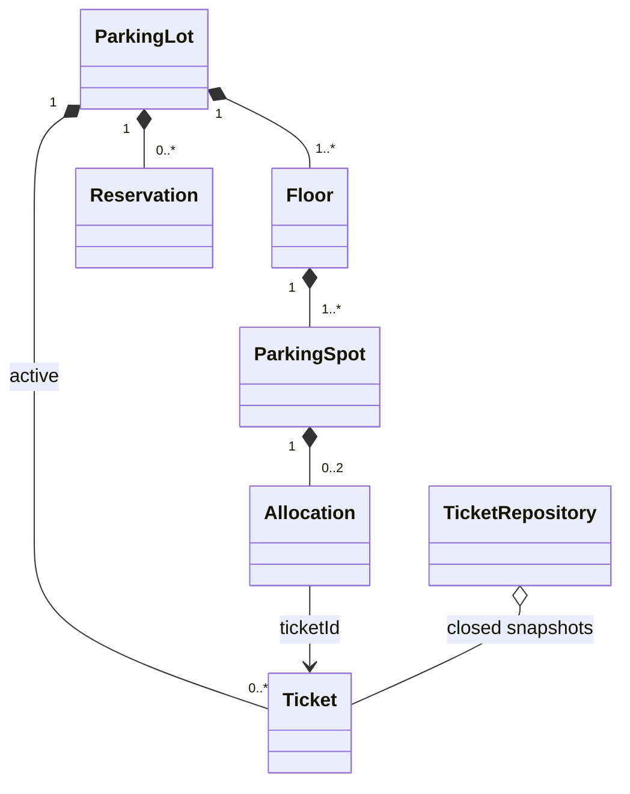

# Parking lot CLI — consolidated v1 specification

## 1. Purpose and scope

Deliver a single-process Java 21 CLI, parsed with Picocli, for an operator managing one parking lot with multiple floors. Keep the domain independent of the CLI and storage. Store all session data in memory; leave repository boundaries suitable for a future SQLite adapter.

Preserved requirements: create a lot, CAR and BIKE spot types, park and issue a ticket, unpark and calculate a prorated fee, registration-based soft reservations, cancellation, vehicle and spot lookup, status, occupancy, revenue, vehicle counts and floor utilization. Only closed tickets contribute to revenue. Inject time and ID generation.

Out of scope: multiple lots, concurrent operators, threads for domain operations, distributed deployment, networking, authentication, authorization, payment collection/integrations, EV charging and SQLite implementation. No claim of durability across process exits. V1 revenue means calculated fees on completed visits, not collected payments.

## 2. Decision register

The original notes do not resolve every behavior. D2 was **confirmed by the product owner on 25 September 2026**: keep reservations as registration records and defer priority. The other entries are **recommended baseline decisions**, not evidence of prior approval. They make the proposed implementation and tests deterministic. Product ownership should accept or change these remaining recommendations before release.

| ID | Ambiguity | Recommended v1 baseline and rationale |
| --- | --- | --- |
| D1 | Independent CLI invocations lose in-memory state | Run an interactive session and optional input-file mode; initialize one store per process, reused for every command. |
| D2 (confirmed) | Soft priority without a queue; some notes also rank “reserved spots” | Keep registration records and defer priority, as confirmed by the product owner. Reservations never own a spot or block capacity. A sequential immediate-allocation CLI has no competing arrivals to prioritize. A vehicle-specific constant bonus cannot change spot ranking. A future priority feature requires a separate queue/dispatch design. |
| D3 | Reservation expiration and completion unspecified | Require an explicit future `--expires-at`; no implicit TTL. Consume on successful matching park; retain terminal records for the session. States: ACTIVE, FULFILLED, CANCELLED, EXPIRED. |
| D4 | Every spot described as two units, but typed spots and code disagree | CAR spot = 2 units, accepts one car or two bikes. BIKE spot = 1 unit, accepts one bike only. Capacity derives from spot type. |
| D5 | Ranking says empty first, which fragments car capacity | Bikes use free BIKE spots first, then partially occupied CAR spots, then empty CAR spots. Cars use empty CAR spots. Tie-break by configured floor order then spot order. |
| D6 | “Prorated” example rounds INR 23.33 to INR 23 | Preserve paise: CAR INR 20/hour, BIKE INR 10/hour; exact elapsed duration, final rounding HALF_UP to two decimals. No minimum charge, grace period or started-hour ceiling. |
| D7 | Lot setup, IDs and reset unspecified | Create once from repeated floor specifications; positive unique floor numbers and nonnegative spot counts, at least one spot on every floor. Generated spot IDs are lot-wide unique. No reset/edit command in v1. |
| D8 | Vehicle count, occupancy and date ranges undefined | Separate currently parked vehicles from completed visits; use capacity-unit occupancy. Historical filters use UTC exit timestamps in a half-open interval. |
| D9 | Registration format absent in notes, restricted in code | Adopt the existing two syntactic patterns with whitespace removal and locale-independent uppercase. This is format validation only, not registry verification. |
| D10 | Saving a closed ticket and lot separately can split state | Commit the updated lot and closed-ticket history together in one application transaction. In memory, publish one replacement state after validation. |

## 3. Runtime and CLI contract

### Session lifecycle

Proposed launcher: `parking-lot` opens an interactive command loop; `parking-lot --file commands.txt` reads the same commands from UTF-8 text. Use the generated Gradle application launcher when implemented. These commands are a target interface, not functionality already present in the repository.

One process owns one store and one set of services. Start with no lot, no tickets and no reservations. Each new launch starts empty. Print this fact at startup. Read one command per line; ignore blank lines. Support quoted arguments so a registration such as `"KA 05 AB 1234"` reaches the normalizer intact. Interactive errors return to the prompt. File mode stops at the first error, reports its line number and returns the command's nonzero code. Previous successful commands remain committed until the process exits. EOF or `exit` ends the session without saving. Do not add a background expiry thread.

### Commands

All data commands require an initialized lot. IDs are case-sensitive; vehicle type accepts CAR/BIKE case-insensitively. Fields shown below are required unless in brackets. Timestamp inputs require ISO-8601 UTC instants ending in `Z`. ID placeholders denote previously returned IDs.

| Command | Input and outcome |
| --- | --- |
| `create-lot --floor 1:2:3 [--floor 2:1:2]` | Each tuple is `floorNumber:carSpots:bikeSpots`. Creates the complete inventory atomically. Return floor count, spot count, total capacity and spot IDs. Second creation fails. |
| `park --registration KA05AB1234 --type CAR` | Return ticket ID, normalized registration, type, floor ID, spot ID, entry time and fulfilled reservation ID if any. |
| `unpark --ticket <ticketId>` | Return receipt with ticket, registration, floor/spot, entry, exit, duration and INR fee. |
| `reserve --registration KA05AB1234 --type CAR --expires-at 2026-09-25T18:00:00Z` | Return reservation ID, created time, expiry and ACTIVE status; clearly state that this record does not guarantee capacity or priority. |
| `cancel-reservation --reservation <reservationId>` | Return resulting status. Repeating cancellation of CANCELLED is a successful no-op. Other terminal statuses reject cancellation. |
| `reservations [--status ACTIVE\|FULFILLED\|CANCELLED\|EXPIRED]` | List all records or filter by effective status at command time; include registration, type, created time and expiry. Empty list is successful. |
| `find-vehicle --registration KA05AB1234` | Return active ticket ID, floor and spot; not currently parked is an error. Does not search history. |
| `find-spot --spot F1-C1` | Return type, total/used/free units, state and occupying ticket IDs/registrations. |
| `status [--floor F1]` | List spots in configured order and lot/floor totals, current vehicle counts and capacity occupancy. Unknown floor is an error. |
| `analytics [--from <instant> --to <instant>]` | Return total revenue and completed visits by type in the interval; also current occupancy, parked counts and floor utilization, explicitly labeled as current. Both range options or neither are required. |
| `help [command]`, `exit` | Help and clean exit work without a lot. Also support standard `--help` on commands. |

Generate `FloorId` as `F<number>` and spot IDs as `F<number>-C<ordinal>` / `F<number>-B<ordinal>`. Floor and spot ordering is numeric (floor number, then CAR before BIKE, then ordinal), never dependent on map iteration or lexicographic `F10` ordering. Ticket, allocation and reservation IDs use typed wrappers and UUID-based values with `T-`, `A-`, `R-` prefixes. Inject generators in tests; reject duplicate generated IDs rather than overwrite records.

### Output and failures

Use human-readable text with stable labels. Output timestamps in UTC, money as `INR 23.33`, durations as elapsed hours/minutes/seconds and percentages to two decimals. On shared CAR spots, releasing one bike means capacity released; do not claim the entire spot is empty.

Result codes: 0 success/help; 2 invalid syntax/value; 3 business rejection; 1 internal/storage failure. Write errors to stderr as `ERROR <code>: <message>`, successes to stdout. Interactive commands expose their result code to the loop without terminating it; normal EOF/exit returns 0. File mode returns the first failed command code. No stack trace for expected errors.

| Category | Stable error codes |
| --- | --- |
| Input (2) | `INVALID_INPUT` (bad enum, ID, registration, timestamp, floor configuration or range) |
| State (3) | `LOT_NOT_INITIALIZED`, `LOT_ALREADY_EXISTS`, `VEHICLE_ALREADY_PARKED`, `NO_SUITABLE_SPOT` |
| Lookup/lifecycle (3) | `TICKET_NOT_FOUND`, `TICKET_ALREADY_CLOSED`, `VEHICLE_NOT_PARKED`, `SPOT_NOT_FOUND`, `FLOOR_NOT_FOUND`, `RESERVATION_NOT_FOUND`, `ACTIVE_RESERVATION_EXISTS`, `RESERVATION_TYPE_MISMATCH`, `RESERVATION_NOT_ACTIVE`, `INVALID_EXIT_TIME` |
| Internal (1) | `INTERNAL_ERROR` (including inconsistent indexes or ID collision), `STORAGE_FAILURE` |

All rejected mutations leave committed business state unchanged. Capture one `Instant` from the injected clock per command. An expiry-derived read status may change as time passes without a committed mutation.

## 4. Domain model and invariants



`ParkingLot` is the only public mutation boundary. Child entities may implement local behavior but callers cannot mutate them independently. Return immutable views/DTOs, defensively copy input collections and never expose writable maps or mutable child instances. Persisted/reconstructed aggregates must pass the same consistency validation as newly created ones.

| Object | Required state and responsibility |
| --- | --- |
| ParkingLot | Floors, active tickets, reservations, registration-to-active-ticket index. Coordinates all invariant-preserving changes. |
| Floor | ID and ordered spots. Inventory is immutable after creation. |
| ParkingSpot | ID, type, allocations; capacity derives from type. Derive used/free units from allocations. |
| Allocation | Immutable ID, ticket ID, registration, vehicle type, allocated time. Capacity consumed derives from type: CAR 2, BIKE 1. |
| Ticket | ID, registration/type, floor/spot snapshots, entry, optional exit/fee, ACTIVE/CLOSED. Snapshot enough information that history never relies on current inventory. |
| Reservation | ID, registration/type, created/expiry times, lifecycle status and terminal timestamp; optional fulfilled ticket ID. No spot ID. |
| Value objects | TicketId, AllocationId, ReservationId, FloorId, SpotId, RegistrationNumber and Money. Reject null and blank IDs; Money is nonnegative INR with canonical two-decimal scale. |

### Capacity and ownership rules

1. A normalized registration has at most one active ticket across the lot.
2. Each active ticket has exactly one allocation in exactly one spot. Each allocation references exactly one active ticket. Registration, type, location and entry time agree.
3. The vehicle index has exactly the same registrations and ticket IDs as active tickets. It is a derived lookup structure maintained inside the aggregate, not independent business state.
4. Spot used units stay between zero and capacity. A vehicle must satisfy both type compatibility and remaining capacity. `canAccommodate(type) = compatible(type) && remainingCapacity >= units(type)`.
5. `isFull = remainingCapacity == 0`; `isEmpty = usedCapacity == 0`. Status is FREE, PARTIAL or FULL. Two free one-unit spots cannot accommodate one car.
6. IDs are unique within their type; spot IDs are unique across the lot. Never replace an existing entity accidentally with `Map.put`.
7. An ACTIVE ticket has no exit or fee; a CLOSED ticket has both, exit is at/after entry and fee is nonnegative. CLOSED cannot reopen or be charged twice.
8. Operational allocations and active tickets live in the lot; closed snapshots live only in ticket history. Snapshot duplication of registration/location is intentional; independent mutable occupancy flags are not.

### Reservations (D2/D3 baseline)

At most one effective ACTIVE reservation per normalized registration, regardless of requested type. Creating a reservation for a currently parked registration fails with `VEHICLE_ALREADY_PARKED`. Reserving when the lot is full is allowed because capacity is not held.

ACTIVE is effective only while `now < expiresAt`. At `now >= expiresAt`, report EXPIRED. For mutations, normalize expired records in the working copy; for reads derive status without changing committed state. No timer or scheduler is needed. A new reservation is allowed after a prior one is fulfilled, cancelled or expired.

Successful parking with an effective ACTIVE reservation requires the same vehicle type and atomically marks it FULFILLED with the ticket ID. Type mismatch fails; the operator must cancel the reservation or use the matching type. A failed park leaves the reservation unconsumed. Expired/cancelled/fulfilled reservations have no effect on future parking. Repeating cancellation of CANCELLED returns that record unchanged; cancelling FULFILLED or EXPIRED fails. Reservations never affect fees, physical capacity or selection order under D2.

### Registration and time

Normalize by removing whitespace and uppercasing with `Locale.ROOT`. Accept either `[A-Z]{2}[0-9]{2}[A-Z]{1,2}[0-9]{4}` or `[0-9]{2}BH[0-9]{4}[A-Z]{1,2}` as the entire normalized input. Reject other punctuation and formats. Examples: `KA 05 AB 1234` becomes `KA05AB1234`; `21 BH 5678 A` becomes `21BH5678A`. Do not claim these patterns establish real registration validity.

The application supplies time to domain methods. Domain code never calls `Instant.now()` directly. Reject an unpark time before entry; do not silently charge zero on clock reversal. Active elapsed time is `elapsedAt(now)`; final `duration()` is defined only for closed tickets and rejects active use.

### Fees

Compute `rate × elapsedDurationInSeconds / 3600` with decimal arithmetic, including the duration's fractional-second component. Avoid integer division and floating-point money. Round once to two decimals using HALF_UP at ticket closure. Examples: CAR at 70 minutes = INR 23.33; BIKE at 90 minutes = INR 15.00; zero duration = INR 0.00. Revenue sums the stored rounded fees, never recalculates them. Rates are fixed for the entire v1 session.

## 5. Architecture and contracts

Keep packages under `com.parkinglot.app`. Existing Guice wiring may be completed; no framework expansion is required.

| Layer | Responsibilities |
| --- | --- |
| `cli` | Session loop, Picocli commands, argument parsing, DTO formatting, error-to-result mapping. No allocation/fee rules. |
| `application.service` | Lot setup, ParkingService, ReservationService, AnalyticsService. Own use-case orchestration and atomic commit boundary. |
| `application.dto` | Immutable command results and read views. |
| `domain.model`, `domain.valueobject` | Entities, invariants and lifecycle rules. No Picocli, Guice or storage dependencies. |
| `domain.policy` | Pure SpotSelectionPolicy and FeeCalculationStrategy. Consume immutable inputs and return decisions/results. |
| `domain.repository` | ParkingLotRepository and TicketRepository ports. |
| `application.port` | Transaction runner and typed ID generator interfaces; application accepts `java.time.Clock`. |
| `infrastructure` | Shared in-memory store, repository/transaction implementations, ID generators, clock setup. Future SQLite adapter belongs here. |
| `di` / bootstrap | Construct one session's object graph and launch command loop. |

Source dependencies point inward: CLI calls application, application uses domain and ports, infrastructure implements ports. Domain does not call infrastructure. The original vertical architecture sketch describes a runtime call sequence, not permission for domain classes to depend on infrastructure.

Suggested aggregate contracts (names may be adapted, semantics must remain):

```text
allocate(ticketId, allocationId, registration, vehicleType, spotId, now) -> TicketSnapshot
release(ticketId, fee, now) -> ClosedTicketSnapshot
createReservation(reservationId, registration, vehicleType, now, expiresAt) -> ReservationSnapshot
cancelReservation(reservationId, now) -> ReservationSnapshot
findActiveTicket(ticketId) -> Optional<TicketSnapshot>
findVehicle(registration) -> Optional<VehicleLocation>
findSpot(spotId) -> Optional<SpotView>
findReservation(reservationId, now) -> Optional<ReservationSnapshot>
```

`allocate` revalidates policy output, uniqueness and reservation eligibility; policy selection never mutates. Reservation fulfillment belongs inside this same aggregate operation. `release` validates first, removes precisely the matching allocation and index entry, closes the ticket and removes it from the active set. The returned closed snapshot is staged in history by the service.

Repository contracts: `ParkingLotRepository.load()` returns optional lot state before initialization; `save(lot)` stages replacement state within a transaction. `TicketRepository.find(id)` returns an optional closed snapshot; `saveClosed(ticket)` rejects non-closed tickets and duplicate ticket IDs; `findClosed(fromInclusive, toExclusive)` returns closed snapshots matching exit time, with an unfiltered form for the session. Reads never expose mutable store references. Repositories should not secretly autocommit independently.

## 6. Command flows and atomicity

For every mutating command, the application opens one working copy of the complete session state (lot plus history), validates input/business rules, applies all changes, validates cross-object invariants and commits by replacing the single stored state reference. An exception discards the working copy. A shallow copy retaining mutable children is insufficient. At this v1 scale, a deep copy or immutable replacement model is simpler than bespoke rollback logic. This boundary includes reservation creation/cancellation and lot initialization.

This is logical exception atomicity within one process. It does not promise recovery from process termination, JVM failure or power loss. A future SQLite implementation must map the same boundary to one database transaction covering both repositories.

### Park

1. Parse and normalize; capture `now`; load the working lot.
2. Reject duplicate parked registration and effective reservation type mismatch.
3. Ask the selection policy for the best eligible spot using D4/D5; absence is `NO_SUITABLE_SPOT`.
4. Generate IDs; call aggregate `allocate`. Create allocation and ACTIVE ticket, add the vehicle index, fulfill a matching reservation.
5. Stage the lot, validate and commit. Return the ticket only after successful commit.

### Unpark

1. Capture `now`; load working state; look up active ticket.
2. If absent, query history: present means `TICKET_ALREADY_CLOSED`; absent means `TICKET_NOT_FOUND`.
3. Reject negative duration; calculate fee using the strategy.
4. Aggregate `release` removes the allocation, active ticket and index and produces a CLOSED snapshot.
5. Stage the closed snapshot and updated lot in the same transaction; validate and commit; return receipt.

No success receipt is emitted before commit. A history-write failure must leave the vehicle parked and revenue unchanged. Repeated unpark rejects without adding history or revenue. Failure to display output after commit does not undo the successful operation; a retry must follow the documented already-closed path.

### Reservation and read flows

Reserve/cancel load a working lot, resolve effective status at the captured instant, validate, mutate through the aggregate and commit. Queries read one coherent committed state and never mutate it. Vehicle lookup uses the registration index, then active ticket/location; missing referenced objects are an internal consistency error, not “not found.”

## 7. Analytics definitions

| Metric | Definition |
| --- | --- |
| Current parked vehicles | Count of active tickets, total and by type. |
| Completed visits | Count of closed tickets in range, total and by type; repeated visits by one registration count separately. |
| Revenue | Sum of stored CLOSED ticket fees in range, INR; ACTIVE tickets contribute nothing. |
| Capacity occupancy | `100 × sum(allocated units) / sum(spot capacity units)` across the lot. |
| Floor utilization | Same formula restricted to that floor. |
| Spot counts | FREE, PARTIAL and FULL counts shown separately from capacity occupancy. |
| Available placements | Number of additional cars = empty CAR spots; additional bikes = total free units. These are alternative capacities, not additive simultaneous guarantees. |

With no range, history covers this session. With a range require `from < to`, include `exitTime >= from` and exclude `exitTime >= to`. A visit beginning before the interval but exiting inside it contributes its entire stored fee. Filters do not time-travel current occupancy. Empty history gives zero counts and INR 0.00. Valid initialized inventory always has positive capacity; querying before creation fails.

Example: one empty BIKE spot and a CAR spot containing one bike means 1 used / 3 total units = 33.33% occupancy, 1 current vehicle, 1 FREE spot, 1 PARTIAL spot, 0 car placements and 2 possible additional bikes.

## 8. Quality and release constraints

Use the repository's Java 21 toolchain, Gradle wrapper and JUnit setup. Keep algorithms straightforward: scanning spots and history is acceptable for this small in-memory CLI. No throughput or maximum inventory target was supplied; do not invent a performance SLA. Reject numeric overflow during inventory parsing/count aggregation instead of creating corrupt capacity.

Required release evidence: build and tests pass on Java 21; acceptance cases pass; runnable launcher supports a multi-command session; help documents state loss and reservation limitations; domain collections cannot be externally mutated; injected-clock tests cover fee/expiry boundaries; failed commits preserve state. The [acceptance plan](acceptance.md) defines the delivery sequence. The [implementation review](implementation-review.md) records why the existing scaffold is not yet a working implementation.
